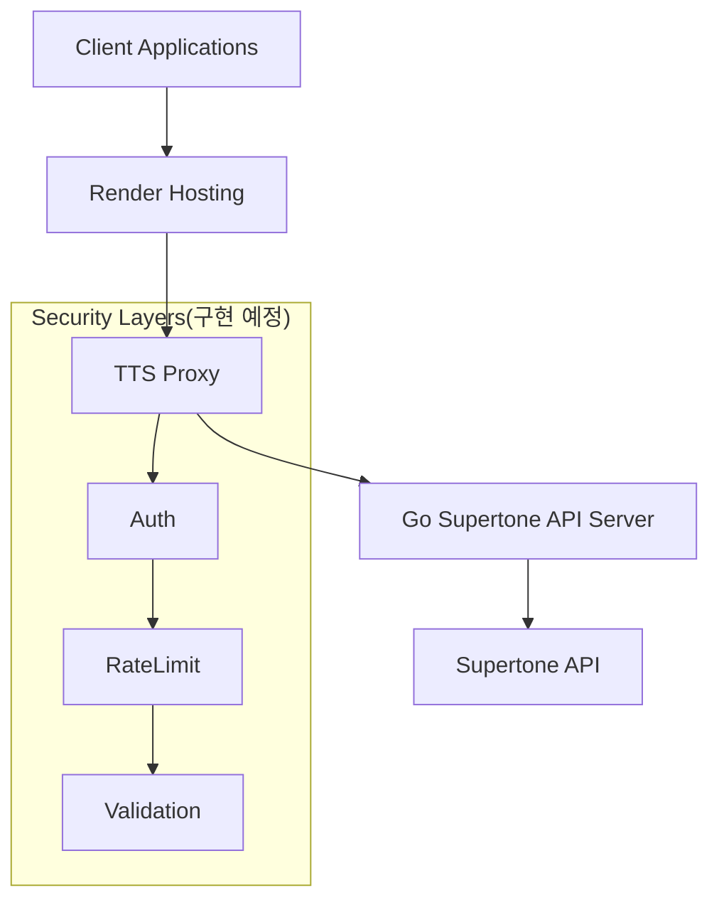

# TTS Proxy Server (Go)

## 목차
1. 프로젝트 목적
2. 아키텍쳐
3. 주요 기능
4. 확장 고려사항
5. 설계 원칙
6. 패키지 구조 예시
7. 환경 설정
8. API 사용법
9. 라우팅 구조

## 프로젝트 목적
- 외부 TTS(Text-to-Speech) API(Supertone 등)를 중계하는 프록시 서버
- 클라이언트가 텍스트 데이터를 POST로 요청하면, 외부 TTS API에 전달 후 응답받은 오디오(MP3)를 반환

## 아키텍쳐


## 주요 기능 (v1)
- `/api/v1/tts/:voiceId` 엔드포인트: `text`, `language`, `style`, `model`, `voice_settings` 등 JSON POST
- **Supertone API 스펙 지원**: `BASEURL/v1/text-to-speech/{voiceId}?output_format=mp3` 형태로 요청
- Voice ID는 URL 경로 파라미터로 전달
- 외부 TTS API에 인증키와 함께 요청, 응답받은 MP3 바이너리 스트림 반환
- 인증 없이 접근 가능 (향후 토큰 기반 인증 구조 고려)
- **Supertone API 지원** (다른 API로 확장 가능)

## 확장 고려사항 (v2+)
- Firebase Auth 기반 인증, Firestore 통한 사용자별 토큰 관리
- 인증/계정 식별 미들웨어 및 추상화 계층 설계

## 설계 원칙
- Go 언어, 클린 아키텍처(Domain, Usecase, Interface, Infrastructure)
- 외부 TTS API Adapter 계층
- 인증 계층 인터페이스/목업
- 환경 변수 또는 YAML로 설정 분리
- 의존성 주입(DI) 구조

## 패키지 구조 예시
```
/cmd/
  main.go
/internal/
  domain/
    tts.go
  usecase/
    tts_service.go
    tts_service_test.go
  interface/
    handler/
      tts_handler.go
      tts_handler_test.go
    middleware/
      auth.go
  infrastructure/
    tts_proxy.go
    http_server.go
/pkg/
  config/
    env.go
    supertone_api_config.go
```

## 환경 설정

### 환경 변수
프로젝트 루트에 `.env` 파일을 생성하거나 환경 변수를 설정하세요:

```bash
# Server Configuration
PORT=8080

# API Routing Configuration
TTS_ENDPOINT=/tts
API_VERSION=v1

# TTS Provider Configuration
TTS_PROVIDER=supertone

# Supertone API Configuration
SUPERTONE_API_URL=https://supertoneapi.com
SUPERTONE_API_KEY=**************************
```

### 기본 설정
- **Server Port**: 8080
- **API Version**: v1
- **TTS Endpoint**: /tts
- **Full API Path**: `/api/v1/tts/:voiceId`
- **TTS Provider**: Supertone (기본값)
- **API URL**: https://supertoneapi.com
- **API Key**: **************************

## 빌드 및 실행
```bash
go run ./cmd/main.go
```

## 테스트
```bash
go test ./...
```

## API 사용법

### TTS 변환 요청 (Supertone API 스펙)
```bash
curl -X POST http://localhost:8080/api/v1/tts/{apiKey} \
  -H "Content-Type: application/json" \
  -d '{
    "text": "안녕하세요, 수퍼톤 API입니다.",
    "language": "ko",
    "style": "neutral",
    "model": "sona_speech_1",
    "voice_settings": {
      "pitch_shift": 0,
      "pitch_variance": 1,
      "speed": 1
    }
  }'
```

### 요청 필드 설명
- **URL Path**: `/api/v1/tts/{voiceId}` - Voice ID를 URL 경로에 포함
- **text** (필수): 변환할 텍스트
- **language** (필수): 언어 코드 (예: "en", "ko", "ja")
- **style** (필수): 음성 스타일 (예: "neutral")
- **model** (필수): 음성 모델 (예: "sona_speech_1")
- **voice_settings** (선택): 음성 설정 (pitch_shift, pitch_variance, speed 등)

### 응답
- **성공**: MP3 오디오 바이너리 스트림 (Content-Type: audio/mpeg)
- **실패**: JSON 에러 메시지

## 라우팅 구조

### API 버전 관리
- 기본 경로: `/api/v1/`
- 환경 변수 `API_VERSION`으로 버전 관리
- 향후 v2, v3 등으로 확장 가능

### 엔드포인트 설정
- 기본 엔드포인트: `/tts/:voiceId`
- 환경 변수 `TTS_ENDPOINT`로 변경 가능
- 예: `/synthesize/:voiceId`, `/text-to-speech/:voiceId` 등

## Supertone API 연동

### 실제 API 호출 구조
```
POST https://supertoneapi.com/v1/text-to-speech/{voiceId}?output_format=mp3
x-sup-api-key: {API_KEY}
Content-Type: application/json

{
  "text": "안녕하세요, 수퍼톤 API입니다.",
  "language": "ko",
  "style": "neutral",
  "model": "sona_speech_1",
  "voice_settings": {
    "pitch_shift": 0,
    "pitch_variance": 1,
    "speed": 1
  }
}
```

### Voice ID 관리
- Supertone에서 제공하는 Voice ID를 사용
- URL 경로 파라미터로 전달: `/api/v1/tts/{voiceId}`
- 필수 파라미터로 검증됨 
